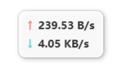
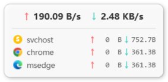
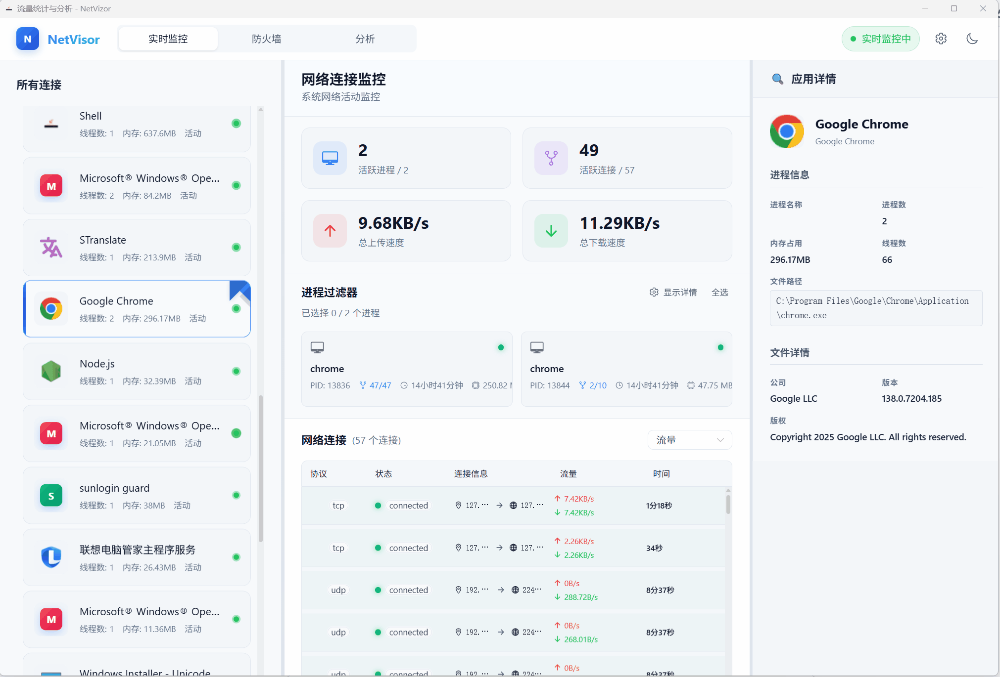

# NetVizor

<div align="center">
  

  [](LICENSE)
  [](https://github.com/duyl328/NetVizor/stargazers)
  [](https://github.com/duyl328/NetVizor/issues)
  [](https://github.com/duyl328/NetVizor/releases)

  <h3>A Modern Windows Network Monitoring and Firewall Management Tool</h3>
  <h3>现代化的 Windows 网络监控与防火墙管理工具</h3>

  [English](#english) | [中文](#chinese)
</div>

---

<a name="english"></a>
## English

### 🚀 Overview

NetVizor is a modern, lightweight Windows network monitoring and firewall management tool that combines TinyWall's simplicity with GlassWire's visualization capabilities. Designed with performance and user experience at its core, it provides real-time network insights and intuitive firewall control.

### ✨ Key Features

#### Real-time Process Network Monitoring
- **Live Process Tracking** - Monitor network connections for every process
- **Real-time Traffic Statistics** - Track upload/download speeds for each process
- **Connection Details** - View protocols, ports, and connection states
- **Historical Data** - Track network usage history over time

#### Firewall Management
- **Easy Rule Creation** - Quick wizard for creating firewall rules
- **One-click Block/Allow** - Instant control over application access
- **Rule Templates** - Pre-configured rules for common applications
- **Windows Firewall Integration** - Built on Windows Firewall APIs

#### Network Usage History & Analytics
- **Real-time Charts** - Traffic graphs powered by ECharts
- **Process Traffic Distribution** - Visual breakdown of bandwidth usage
- **Modern UI** - Clean, responsive interface built with Vue 3

### Interface Overview

- **Floating Window**
 

- **Top Speed List**
 

- **Real-time Monitoring**
 

<details>
<summary>Click to expand GIF demonstrations</summary>

- **Firewall Management**
 

- **Historical Data Analysis**
 

</details>

### 🚀 Quick Start

1. Download the latest version from [Releases](https://github.com/duyl328/NetVizor/releases)

2. Extract the archive to your preferred directory and run `Shell.exe` (Administrator privileges required for ETW and Firewall API access)

3. After startup, a network speed floating window will appear in the top-right corner of your screen, and the application will be available in the system tray

4. Right-click the floating window to access settings, or navigate to "Traffic Statistics & Analysis" for detailed monitoring and configuration

### 🔧 Building from Source

```bash
# Clone the repository
git clone https://github.com/duyl328/NetVizor.git
cd NetVizor

# Build backend
cd src/NetVizor.Backend
dotnet build

# Build frontend
cd ../NetVizor.Frontend
npm install
npm run build

# Run the application
cd ../NetVizor.Backend
dotnet run
```

### 📋 System Requirements

- Windows 10/11 (x64)
- .NET 8.0 Runtime
- WebView2 Runtime
- Administrator privileges (required for firewall management and ETW data collection)

### 🛠️ Technology Stack

#### Backend
- **Framework**: .NET 8.0 + WPF
- **Data Collection**: ETW (Event Tracing for Windows)
- **Database**: SQLite
- **Communication**: HTTP + WebSocket

#### Frontend
- **UI Framework**: Vue 3 + TypeScript
- **Build Tool**: Vite
- **Charts**: ECharts
- **UI Components**: NaiveUI
- **Rendering**: WebView2

### 🗺️ Roadmap

- **Network Access Detection & Alerts**
  - User-configurable detection rules
  - Popup/sound/log alerts when applications trigger rules
  - Filtering by process, port, IP, protocol, and more

- **Taskbar Network Speed Display**
  - Real-time network speed display in taskbar/control bar
  - Alternative to floating window display

- **Bandwidth Limiting**
  - Bandwidth throttling before network requests complete
  - Per-application or global upload/download speed limits

- **Enhanced Firewall Management**
  - Comprehensive rule creation, editing, and batch management
  - Multi-condition rules (application, IP, port, protocol, direction)
  - Rule templates and quick-apply functionality

- **GeoIP Mapping**
  - Map connection IPs to geographic locations
  - Map visualization of connection distribution

- **Custom Alerts**
  - Notify users when:
    - Network speed anomalies occur
    - Unknown programs connect to network
    - Connections to blacklisted IPs

- **DNS Resolution**
  - Resolve remote IPs to domain names
  - Easy identification of connection targets

- **Multi-language Support**
  - Support for English, Chinese, and other languages
  - Internationalized UI

- **Behavior-based Automatic Rule Suggestions**
  - Analyze application network behavior patterns
  - Automatically suggest appropriate firewall rules

### 🤝 Contributing

1. Fork the repository
2. Create your feature branch (`git checkout -b feature/AmazingFeature`)
3. Commit your changes (`git commit -m 'Add some AmazingFeature'`)
4. Push to the branch (`git push origin feature/AmazingFeature`)
5. Open a Pull Request

### 📝 License

This project is licensed under the GPL 3.0 License - see the [LICENSE](LICENSE) file for details.

### 🙏 Acknowledgments

- Inspired by TinyWall and GlassWire
- Built on Windows ETW and Firewall APIs
- UI powered by Vue.js and ECharts

### 🌟 Star History

[](https://star-history.com/#duyl328/NetVizor&Date)

### 📞 Contact

- Issues: [GitHub Issues](https://github.com/duyl328/NetVizor/issues)
- Discussions: [GitHub Discussions](https://github.com/duyl328/NetVizor/discussions)
- Email: yylyou333@gmail.com

### 💖 Support the Project

If you find this project helpful, please consider:
- ⭐ **Starring the project**
- 🐛 Reporting bugs
- 💡 Suggesting new features
- 🤝 Contributing code

---

<a name="chinese"></a>
## 中文

### 🚀 概述

NetVizor 是一个现代化、轻量级的 Windows 网络监控和防火墙管理工具，它结合了 TinyWall 的简洁性和 GlassWire 的可视化能力。以性能和用户体验为核心设计理念，提供实时网络洞察和直观的防火墙控制。

### ✨ 功能特性

#### 实时进程网络监控
- **实时进程追踪** - 监控每个进程的网络连接
- **实时流量统计** - 监控每个进程的上传/下载速度
- **连接详情** - 查看协议、端口和连接状态
- **历史数据** - 追踪网络使用历史记录

#### 防火墙管理
- **便捷规则创建** - 快速向导创建防火墙规则
- **一键阻止/允许** - 即时控制应用程序网络访问
- **规则模板** - 常见应用程序的预配置规则
- **Windows 防火墙集成** - 基于 Windows 防火墙 API 构建

#### 网络使用历史与分析
- **实时图表** - 由 ECharts 驱动的流量图表
- **进程流量分布** - 带宽使用的可视化分解
- **现代化 UI** - 使用 Vue 3 构建的简洁、响应式界面

### 界面概览

- **悬浮窗**
 

- **网速排行榜**
 

- **实时监控**
 

<details>
<summary>点击展开 GIF 演示</summary>

- **防火墙管理**
 

- **历史数据分析**
 

</details>

### 🚀 快速开始

1. 从 [Releases](https://github.com/duyl328/NetVizor/releases) 下载最新版本

2. 将压缩包解压至指定目录，运行 `Shell.exe` 即可（软件启动需要管理员权限，ETW 与防火墙 API 均需管理员权限）

3. 软件启动后会在电脑右上角显示网速悬浮窗，右下角系统托盘也会同时显示软件图标

4. 您可以右击悬浮窗进入设置页面，或者进入"流量统计与分析"来进行详细查看和设置

### 🔧 从源码构建

```bash
# 克隆仓库
git clone https://github.com/duyl328/NetVizor.git
cd NetVizor

# 构建后端
cd src/NetVizor.Backend
dotnet build

# 构建前端
cd ../NetVizor.Frontend
npm install
npm run build

# 运行应用程序
cd ../NetVizor.Backend
dotnet run
```

### 📋 系统要求

- Windows 10/11 (x64)
- .NET 8.0 Runtime
- WebView2 Runtime
- 管理员权限（用于防火墙管理和 ETW 数据收集）

### 🛠️ 技术栈

#### 后端技术
- **框架**: .NET 8.0 + WPF
- **数据收集**: ETW (Event Tracing for Windows)
- **数据库**: SQLite
- **通信**: HTTP + WebSocket

#### 前端技术
- **UI 框架**: Vue 3 + TypeScript
- **构建工具**: Vite
- **图表库**: ECharts
- **UI 组件**: NaiveUI
- **渲染**: WebView2

### 🗺️ 开发路线图

- **网络访问检测与报警**
  - 支持用户自定义检测规则
  - 当软件触发规则时可进行弹窗/声音/日志报警
  - 可按进程、端口、IP、协议等条件设置

- **任务栏网速显示**
  - 在悬浮窗外，提供任务栏/控制栏的实时网速显示
  - 作为悬浮窗显示的替代方案

- **网速限制功能**
  - 在网络请求完成前进行带宽限制
  - 可针对单个应用或全局限制上传/下载速度

- **防火墙管理增强**
  - 更加全面的规则创建、编辑和批量管理能力
  - 支持按应用、IP、端口、协议、方向等多条件组合规则
  - 提供规则模板和快速应用功能

- **GeoIP 地理映射**
  - 将连接的 IP 地址映射到地理位置
  - 地图可视化展示连接分布

- **自定义报警系统**
  - 当出现以下情况时通知用户：
    - 网速异常波动
    - 未知程序联网
    - 连接到黑名单 IP

- **DNS 域名解析**
  - 将远程 IP 解析为域名
  - 便于快速识别连接目标

- **多语言支持**
  - 支持英文、中文等多语言切换
  - 国际化用户界面

- **基于行为的自动规则建议**
  - 分析程序的联网行为模式
  - 自动推荐相应的防火墙规则

### 🤝 贡献指南

1. Fork 本仓库
2. 创建您的功能分支 (`git checkout -b feature/AmazingFeature`)
3. 提交您的更改 (`git commit -m 'Add some AmazingFeature'`)
4. 推送到分支 (`git push origin feature/AmazingFeature`)
5. 打开一个 Pull Request

### 📝 许可证

本项目采用 GPL 3.0 许可证 - 查看 [LICENSE](LICENSE) 文件了解详情。

### 🙏 致谢

- 灵感来自 TinyWall 和 GlassWire
- 基于 Windows ETW 和防火墙 API 构建
- UI 由 Vue.js 和 ECharts 驱动

### 🌟 Star History

[](https://star-history.com/#duyl328/NetVizor&Date)

### 📞 联系我们

- Issues: [GitHub Issues](https://github.com/duyl328/NetVizor/issues)
- Discussions: [GitHub Discussions](https://github.com/duyl328/NetVizor/discussions)
- Email: yylyou333@gmail.com

### 💖 支持项目

如果您觉得这个项目有帮助，请考虑：
- ⭐ **给项目加星**
- 🐛 报告问题
- 💡 建议新功能
- 🤝 贡献代码