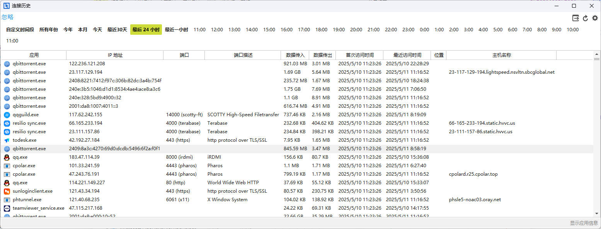
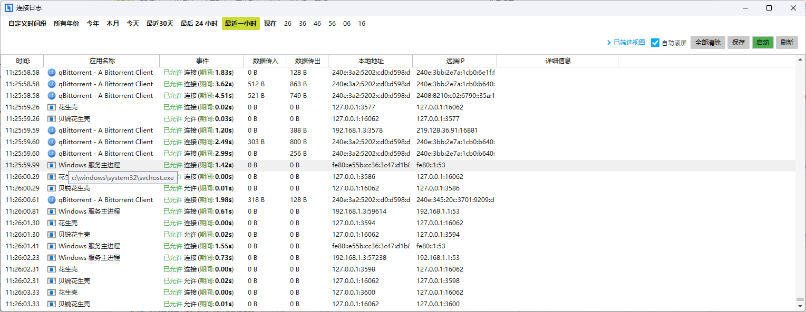
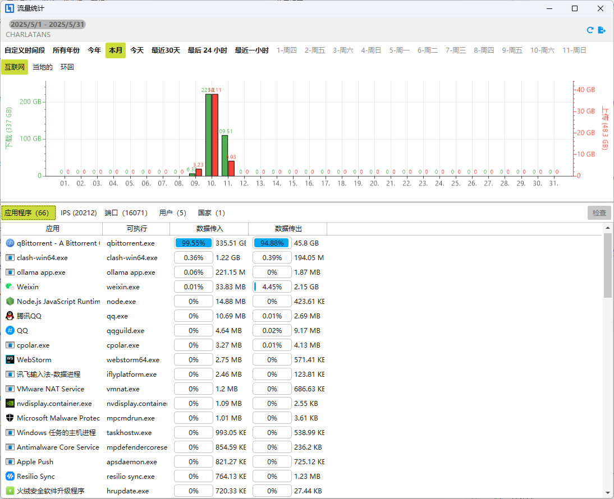
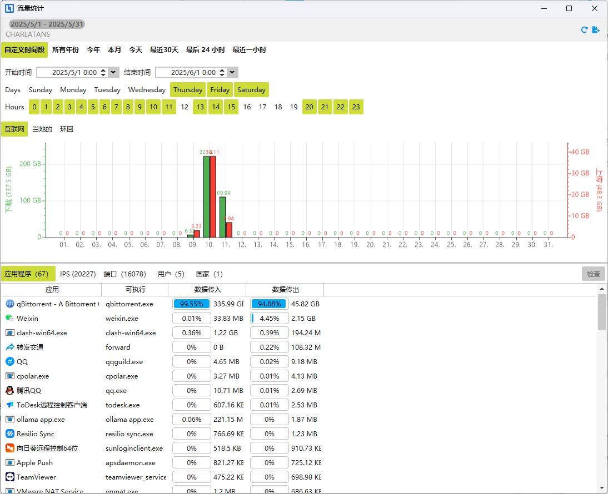

# net-src

This template should help get you started developing with Vue 3 in Vite.

## Recommended IDE Setup

[VSCode](https://code.visualstudio.com/) + [Volar](https://marketplace.visualstudio.com/items?itemName=Vue.volar) (and disable Vetur).

## Type Support for `.vue` Imports in TS

TypeScript cannot handle type information for `.vue` imports by default, so we replace the `tsc` CLI with `vue-tsc` for type checking. In editors, we need [Volar](https://marketplace.visualstudio.com/items?itemName=Vue.volar) to make the TypeScript language service aware of `.vue` types.

## Customize configuration

See [Vite Configuration Reference](https://vite.dev/config/).

## Project Setup

```sh
npm install
```

### Compile and Hot-Reload for Development

```sh
npm run dev
```

### Type-Check, Compile and Minify for Production

```sh
npm run build
```

### Run Unit Tests with [Vitest](https://vitest.dev/)

```sh
npm run test:unit
```

### Lint with [ESLint](https://eslint.org/)

```sh
npm run lint
```


1. 流量图表：定时查询指定网络的信息并记录，根据线程为单位将内容记录下来
2. 进程网络限制：上传/下载拦截（未设置、询问、拦截、允许）
3. 限额：上传限额、下载限额
4. 获取网络列表（本地连接；以太网等 连接状态信息、IP信息）
5. 应用列表（列出所有活动或安装的软件，包括：软件状态、内存占用、CPU占用等信息）
6. TCP 和 UDP 的连接历史,对于目标端口第一次和最后一次连接时间

7. 连接日志

8. 流量统计。按照年、月、周、日、12小时、6小时、3小时、1小时、30分钟、5分钟(应用、主机、流量类型、国家等维度筛选显示) 进行分段；用户可选查看时间（日期和小时的选择可以滑动选择）；按照应用程序，端口、目标地址等内容信息进行展示和分类


9. 对于不同的 网络环境、GPS 地址、设备状态（电量、设备模式） 自动切换联网控制规则（公司的网络切换某些软件联网；个人网络则打开某些软件联网）
10. 配置文件可导入导出
11. 网络连接地图：不同软件联网的IP是那个区域和国家
12. 联网规则可设置有效时间（5分钟、10分钟、20分钟、30分钟、45分钟、1小时、3小时、6小时、12小时、1天、1周、自定义时间）、关机后重置、关闭软件后重置、永久有效
13. 弹出连接请求提示，可选择允许/拒绝，并可记忆成规则


所连接服务器的地理位置


我在做一个专业的网络信息管理工具，主要能做到对于网络信息的监控，比如网速，当前网速，以及每个软件的网速，我想的是把这些收集到的信息保存起来，然后可以增加一个历史数据分析页面。这是我们的前景提要。现在，对于C#来说我想用Sqlite进行数据保存，因为我的软件是要离线运行，并且单机可用的，所以不能用Mysql或者其他繁重的数据库。

我目前的整体想法如下：
关于网速的情况的分析分为两个表：一个是全局网速占用、一个是每个软件的网速占用。对于全局网速占用每1分钟写入一次，一天大概有1440条数据，一个月大概4万条数据
对于每分钟的数据记录只记录一个月，超过一个月的将对应范围内的数据压缩为天进行报错，删除最原始的每分钟数据。
对于单个软件网速占用，每5秒进行统计，该数据只保存在内存中，不保存数据库，并且内存中的网速记录只周期记录最近6个小时。于此同时，写入数据库的依然是按照分钟进行记录，
一个软件一周大概1万条数据，如果用户有100个软件，那么一周就是100万个，为了防止数据库崩溃，只记录一周的数据，超过的一周的数据按照全局信息的管理方式，将其压缩为天进行存储，
删除原始每分钟数据。
对于单个软件网速的记录采用 可执行文件的路径作为ID进行数据存储，第二个字段为时间，其他的分别为：上传总量、下载总量、网卡、时间戳、
于此同时也可以记录网络连接的信息：时间戳 本地IP 本地端口 远程IP 远程端口 协议 上传字节 下载字节 可执行文件路径。这些连接信息每分钟只保存流量最多的100条（后期开放用户可定义数量，
但是不能超过100）。该信息最多只保存1天，超过1天就合并删除。超过1周的数据再次聚会删除。超过1个月再次处理。

软件信息的记录：
名字、路径、版本、公司、ICON等

归档与清理任务的调度
使用 BackgroundWorker / Timer / Task 定期执行：
按月归档
删除旧数据
合并压缩历史数据（比如求平均/最大/最小）

异常崩溃后的恢复
建议使用 WAL 模式 + 定期备份数据库文件。

常见的异常事件类型：
连接异常
连接失败（如 TCP 三次握手失败）
连接超时、断开异常
流量异常
突然流量暴增或骤降
单个 IP/端口流量异常（过高或过低）
安全告警
访问黑名单 IP 或域名
非法端口访问（比如非标准端口被访问）
端口扫描行为检测
异常登录/连接尝试
软件异常
某进程网络异常终止
网络接口断开或重连
系统网络错误（如 DNS 解析失败）


事件日志的记录结构建议
| 字段       | 说明                          |
| -------- | --------------------------- |
| 事件ID     | 唯一标识                        |
| 时间戳      | 事件发生时间                      |
| 事件类型     | 如“连接失败”、“异常流量”、“黑名单访问”等     |
| 相关进程/应用  | 关联的进程路径或名称（如果有）             |
| 本地 IP/端口 | 事件关联的本地地址                   |
| 远程 IP/端口 | 事件关联的远程地址                   |
| 事件描述     | 详细描述，如“连接 8.8.8.8:443 超过阈值” |
| 严重等级     | Info/Warning/Error/Critical |
| 额外数据     | 可 JSON 格式存储其他细节信息           |


CREATE TABLE event_log (
event_id INTEGER PRIMARY KEY AUTOINCREMENT,
timestamp DATETIME NOT NULL,
event_type TEXT NOT NULL,
process_path TEXT,
local_ip TEXT,
local_port INTEGER,
remote_ip TEXT,
remote_port INTEGER,
severity TEXT NOT NULL,
description TEXT,
extra_data TEXT -- JSON 格式可选
);


端口扫描行为如何检测？
检测思路
短时间内对多个端口发起连接尝试：

同一源 IP 在短时间内向同一目标 IP 扫描多个端口。

大量连接失败：

多个端口连接失败，说明可能是扫描。

连接速率异常：

短时间内连接速率远高于正常业务连接。

实现方法
滑动时间窗口统计：记录单位时间内访问某目标IP的端口次数。

阈值判断：超过阈值触发告警。

结合连接失败率：如果大部分端口连接失败，更可能是扫描。

黑名单过滤：过滤已知安全扫描器IP。


